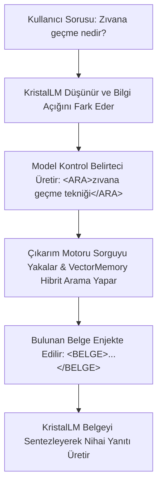

# Skill 6: Vektörel Bellek ve Otonom Self-RAG (Vector Memory & Self-RAG) - Taşıyıcı Sistem

Bu doküman, Türkçe Kristal-Vektörel Mimarisi'nin bilgi geri çağırma (Retrieval), Merak Motoru (Curiosity Engine), Tri-Modal Router ve modelin kendi bilgi açığını fark edip arama yapmasını sağlayan **Otonom Self-RAG** boru hattını detaylandırır.

---

## 🏛️ Hibrit Vektörel Bellek (`VectorMemory`)

`VectorMemory` sınıfı (`src/rag/vector_memory.py`), anlam benzerliği (yoğun vektör) ile biçimbirimsel kesin eşleşmeyi (seyrek vektör) bir arada değerlendiren hibrit bir arama altyapısı sunar.

### 1. Koleksiyon Yapısı ve İndeksleme
*   **Yoğun Vektör Uzayı (`dense`):** 768 boyutlu vektörler üzerinde Cosine uzaklığı (`Distance.COSINE`) kullanarak anlamsal yakınlık araması yapar.
*   **Seyrek Vektör Uzayı (`sparse`):** Qdrant üzerinde `Modifier.IDF` parametresiyle otomatik TF-IDF ağırlıklandırması yaparak morfem düzeyinde kesin eşleşme tespiti sağlar.
*   **Dayanıklı Fallback Mekanizması:** Gerçek ortamda `localhost:6333` üzerindeki Qdrant sunucusuna bağlanır; sunucu kapalıysa veya ağ hatası alınırsa sistem çökmeden şeffaf biçimde bellek içi (`:memory:`) geçici depoya geçiş yapar.

### 2. Hibrit Arama ve RRF (Reciprocal Rank Fusion)
*   Sorgu yapıldığında yoğun ve seyrek arama kanallarından aday dökümanlar geri çağrılır.
*   Arama sonuçları, Qdrant'ın yerleşik RRF algoritması (`Fusion.RRF`) ile harmanlanarak ortak bir sıralamaya sokulur.

### 3. Morfolojik Kısıt Filtrelemesi (Token-Type Constraint)
*   Sorgudaki ayırt edici kökler (`distinctive_query_roots`) filtrelenir (durdurma kelimeleri [stop words] olan `su`, `bir`, `ve`, `da`, `ki` vb. ile ekler elenir).
*   Geri çağrılan her bir dökümanın içerdiği kök morfemler sorgudaki ayırt edici köklerle karşılaştırılır.
*   Eğer dökümandaki köklerin sorgu kökleriyle örtüşme oranı **%50'nin altındaysa, dökümanın skoru yarı yarıya cezalandırılır (`score *= 0.5`)**.

---

## 🧭 Merak Motoru ve Tri-Modal Yönlendirici (`src/rag/merak.py` & `src/llm/router.py`)

1.  **Merak Motoru (Curiosity Engine):** Modelin girdi karşısındaki şaşkınlığını (perplexity) ve leksikal örtüşme oranını hesaplar.
2.  **Tri-Modal Router:** Girdiyi analiz ederek üç moddan birine yönlendirir:
    *   **İçsel Bilgi Modu:** Modelin kendi parametrik ağırlıklarının yettiği durumlar.
    *   **Vektörel Bellek / RAG Modu:** Bilgi açığı veya olgusal eksiklik tespit edildiğinde dış belleğe danışma modu.
    *   **Pedagojik Mod:** Modelin yeni bir dilbilgisi veya anlamsal kural öğrendiği aktif eğitim modu.

---

## 🤖 Otonom Self-RAG İş Akışı

Geleneksel dışarıdan enjekte edilen RAG yerine, KristalLM modelinin kendisi sorgu üretmeyi ve belgeyi sentezlemeyi öğrenir:

### Self-RAG Süreç Aşamaları:
1.  **Sorgu Emisyonu:** Model yanıta başlarken doğrudan ezbere konuşmak yerine bilgi açığını fark ederse `<ARA> ... </ARA>` etiketleri arasında bir arama sorgusu üretir.
2.  **Etkileşimli Arama:** Çıkarım motoru bu etiketleri saptar, üretimi geçici olarak durdurur ve `VectorMemory` üzerinden en alakalı dökümanı bulur.
3.  **Belge Enjeksiyonu:** Bulunan döküman `<BELGE> ... </BELGE>` etiketleri arasına yerleştirilerek modelin bağlam penceresine dahil edilir.
4.  **Sentez ve Çıktı:** Model eklenen belgeyi okuyarak doğru, kaynaklı ve tutarlı nihai yanıtını oluşturur.
5.  **Doğrulama:** Bu yetenek `scripts/test_rag_interactive.py` betiği ile interaktif olarak test edilmekte ve doğrulanmaktadır.
