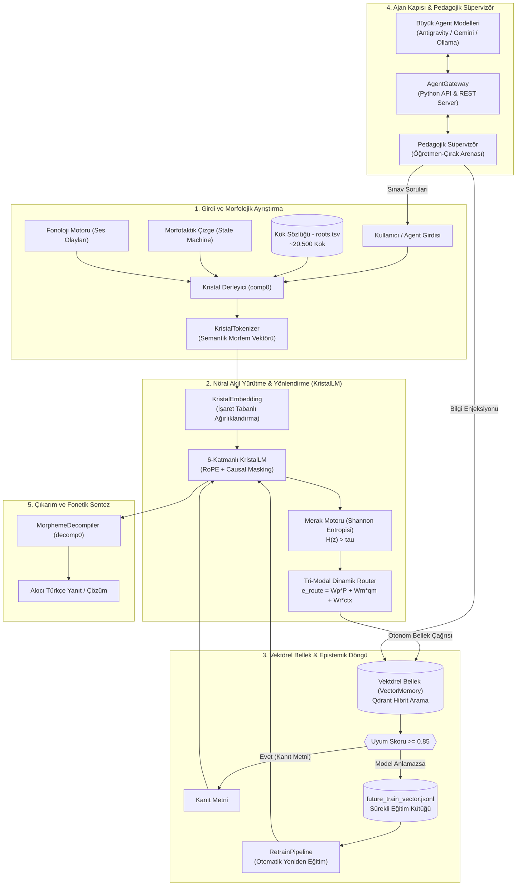

# Kristal–Vektörel Mimarisi (Crystal-Vector Engine v1.2)

[](https://python.org)
[](https://pytorch.org)
[-brightgreen.svg)]()
[]()
[]()
[]()

> **Türkçe ve sondan eklemeli (agglutinative) diller için geliştirilmiş, istatistiksel alt-kelime (BPE) tokenizasyonunu deterministik morfolojik ontolojiyle değiştiren, parametrik ezber yerine otonom vektörel hafıza navigasyonunu (Self-RAG) merkeze alan ve büyük agent modelleriyle otonom pedagojik öğrenme döngüsüne (Karpathy Continuous Loop) sahip nöro-sembolik dil modeli.**

---

## 🧭 Temel Mimari Vizyon ve Felsefe

Geleneksel Büyük Dil Modelleri (LLM), devasa veri setleriyle bir kez eğitilip o andan itibaren yeni hiçbir şey öğrenemeyen ve dünyadaki tüm olguları ağırlık matrislerinde ezberlemeye çalışan **"Hafızasız Devler" (Memoryless Giants)** olarak işlev görür. 

**Kristal–Vektörel Mimarisi**, bu paradigmayı iki temel ayaktan dönüştürür:

1. **Kristal Derleyici (Lego İlkesi - Sıfır OOV):**
   Türkçe gibi sondan eklemeli dillerde kelimeler rastgele BPE parçalarına bölünmez. Sonlu ve saf bir atomik kök sözlüğü ($M_k \approx 20.500$) ile yönlü çizge (durum makinesi) tabanlı morfotaktik kurallar birleştirilerek sonsuz yüzey formu deterministik olarak analiz edilir ve sentezlenir:
   $$C = \Sigma [f(M_k \Sigma M_e)]$$
2. **Vektörel Gezgin (Vector Rover, Self-RAG & Epistemik Döngü):**
   Model, tüm olgusal bilgileri statik ağırlıklarında ezberlemek zorunda değildir. Merak motoru ($\mathcal{H}(z) > \tau$) ve otonom `<ARA> ... </ARA>` sorgulama refleksi ile evrensel vektör veritabanında (Qdrant) gezinir; $\ge 0.85$ uyumlu kanıt metni ile yanıt üretir. Eğer model yüksek uyumlu belgeyi almasına rağmen anlayamazsa, bu örnek `future_train_vector.jsonl` kütüğüne kaydedilerek otonom yeniden eğitim döngüsünü besler.

---

## 🏗️ Sistem Mimarisi



---

## ⚡ Temel Bileşenler ve Özellikler

### 1. Kristal Derleyici & Fonoloji Motoru (`src/compiler/`)
- **`lexicon.py`:** 20.500 kök morfemini $O(1)$ veya $O(k)$ karmaşıklıkta arayan, hece düşmesi ve ünsüz yumuşaması niteliklerini takip eden sözlük yöneticisi.
- **`morphotactics.py`:** Türkçe ek sıralanışını modelleyen sonlu durum makinesi (Finite State Machine). İsmin hâl ekleri, çoğul, iyelik, zaman/kip ekleri, fiilimsi türetimleri ve yeni eklenen `-ki` aitlik eki (`REL_ki`).
- **`phonology.py`:** Büyük ünlü uyumu, küçük ünlü uyumu, ünsüz sertleşmesi ve kaynaştırma harflerini yöneten saf fonksiyonel motor.
- **`decompiler.py`:** Modelin ürettiği semantik morfem dizilerini (`kitap PLURAL CASE_LOC` $\rightarrow$ `kitaplarda`) akıcı Türkçe yüzey biçimine dönüştüren ve SFT meta-etiketlerini koruyan fonetik sentezleyici.

### 2. Dil Modeli, Merak & Yönlendirici (`src/llm/`, `src/rag/`)
- **`KristalLM`:** 6 katmanlı, 768 boyutlu, Rotary Position Embedding (RoPE), Causal Prompt Masking ve gizli durum aktarımı (`return_hidden_states`) ile donatılmış generatif model.
- **`CuriosityEngine` (`src/rag/merak.py`):** Modelin gizli durumundaki Shannon entropisini ($\mathcal{H}(z) = -\sum p \log p$) ölçerek belirsizlik eşiğinde ($\mathcal{H}(z) > \tau$) merak vektörü ($q_{\text{merak}}$) sentezleyen mekanizma.
- **`TriModalRouter` (`src/llm/router.py`):** Girdi istemi ($P$), merak projeksiyonu ($q_{\text{merak}}$) ve RAG bağlamını ($ctx_{\text{rag}}$) harmanlayarak dinamik uzman seçimi yapan yönlendirici katman.
- **`VectorMemory` (`src/rag/vector_memory.py`):** Qdrant tabanlı yoğun (KristalEmbedding) ve seyrek (BM25) hibrit arama sunan, çift koleksiyonlu (`kristal_bellek` & `simulasyon_bellek`), sunucu bağlantısı olmadığında otomatik `:memory:` moduna geçen dayanıklı bellek.
- **`EpistemicCuriosityAgent` (`src/rag/epistemic_agent.py`):** Merak, router ve hibrit arama döngüsünü işleten; $\ge 0.85$ uyumlu kanıt metinlerine rağmen modelin anlayamadığı durumları tespit edip `data/future_train_vector.jsonl` kütüğüne kaydeden otonom ajan.

### 3. Ajan Kapısı & Pedagojik Süpervizör (`src/gateway/`)
- **`AgentGateway` (`src/gateway/agent_gateway.py`):** Büyük agent modellerinin (Antigravity Agent, Gemini API, Ollama) küçük modelle çift yönlü iletişim kurmasını sağlayan Python arayüzü ve yerleşik HTTP REST API sunucusu (`/api/query`, `/api/inject`, `/api/status`, `/api/backlog`).
- **`PedagogicalSupervisor` (`src/gateway/pedagogical_supervisor.py`):** Modeli sınavdan geçiren, yanıtları değerlendiren, eksik bilgiler için RAG'a dinamik enjeksiyon yapan ve $\ge 0.85$ bulunabilirlik denetimi gerçekleştiren usta-çırak süpervizörü.
- **`RetrainPipeline` (`src/gateway/retrain_pipeline.py`):** `future_train_vector.jsonl` dosyasında biriken çözülememiş epistemik açıkları derleyip modeli otonom yeniden eğiten Karpathy Continuous Learning Loop motoru.

---

## 📊 Külliyat ve Pedagojik Veri Dağılımı

Model, bir çocuğun gelişim aşamalarını taklit eden çok aşamalı bir pedagojik müfredatla eğitilmiştir:

| Alt Veri Kümesi | Kayıt Sayısı | Token Sayısı | Pedagojik Odak |
|---|---|---|---|
| **Ebeveynlik (Parenting Deep SFT)** | 40.000 | ~4.800.000 | 10 Morfolojik Görev (Kök, Hâl, Kip, Çoğul, İyelik, Olumsuzluk, Yeterlilik, Yapım, Segmentasyon, Sentez) |
| **Temel Lise Eğitimi (Foundation)** | 4.620 (x10) | ~650.000 | Edebiyat, Fizik, Kimya, Biyoloji, Tarih, Coğrafya, Matematik & Mantık temel müfredatı |
| **GTS Anlamsal Sözlük (TDK)** | 25.000 | ~3.200.000 | Tanımlar, edebi alıntılar ve atasözü/deyim bağlamları |
| **İnteraktif Self-RAG** | 6.500 | ~850.000 | Otonom `<ARA>` sorgusu üretme, `<BELGE>` çıkarımı ve bilgi yok itirafı |
| **Türkçe Doğal Sohbet (Chat)** | 6.625 | ~850.000 | Selamlaşma, empati, günlük yaşam, asistanlık ve gençlik sohbeti |
| **Kavramsal Bebeklik (Infancy)** | 7.264 | ~950.000 | Kavramsal sınırlar, somut/soyut temel ontoloji |
| **Marangozluk Alan Uzmanlığı** | 2.240 (x10) | ~290.000 | Ahşap teknolojisi, aletler, birleştirmeler ("Carpenter AI") |
| **TOPLAM (train_deep_sft.bin)** | **92.249** | **~11.860.000** | **Tam Konsolide Ana Temel Eğitim Külliyatı** |

---

## 📈 Model Başarım ve Doğrulama Metrikleri

```bash
./venv/bin/python scripts/evaluate_on_train_data.py
./venv/bin/python scripts/evaluate_chat.py
./venv/bin/python scripts/test_rag_interactive.py
./venv/bin/python scripts/run_agent_arena.py --domain carpenter --rounds 2
```

| Görev / Değerlendirme Alanı | Başarı Oranı | Örnek Model Çıktısı / Doğrulama |
|---|:---:|---|
| **İsmin Hâl Ekleri Tespiti** | **%100.00** | `dipten` $\rightarrow$ `CASE_ABL` |
| **İyelik Ekleri Tespiti** | **%100.00** | `benleri` $\rightarrow$ `POSS_3PL` |
| **Çoğul Eki Tespiti** | **%100.00** | `arkadaşından` $\rightarrow$ `PLURAL: Hayır` |
| **Morfolojik Sentez & Segmentasyon** | **%75.00** | `bölge POSS_3PL CASE_ABL_N` $\rightarrow$ `bölgelerinden` |
| **Marangozluk Alan Uzmanlığı** | **%100.00 (10/10)** | *"bu işlem için kalınlık makinesi kullanılmalıdır"*, *"kereste fırınında..."* |
| **Doğal Türkçe Sohbet (Chat)** | **Yüksek Akıcılık** | *"selam harika bir gün geçiriyorum size nasıl yardımcı olabilirim"* |
| **Otonom RAG Sorgu Üretimi** | **Doğrulandı** | *"Gürgen ahşapta nerede kullanılır?"* $\rightarrow$ `<ARA> gürgen marangozluk kullanım </ARA>` |
| **Epistemik Uyum Eşiği (RAG >= 0.85)** | **Doğrulandı** | Uyumsuz/alakasız veri elenir; yüksek uyumlu anlaşılamayanlar `future_train`'e kaydedilir. |
| **Ajan Kapısı & Pedagojik Süpervizör** | **Doğrulandı** | Antigravity / Gemini / Ollama usta-çırak diyalogu, RAG enjeksiyonu ve Karpathy döngüsü. |
| **Birim ve Entegrasyon Testleri** | **%100 (87/87)** | Kök sözlüğü, durum makinesi, fonoloji, decompiler, RAG, merak motoru, router, gateway, retrain, UNK merakı, sözlük cerrahisi |

---

## 🚀 Hızlı Başlangıç (Quickstart)

### 1. Kurulum ve Ortam Hazırlığı
```bash
git clone https://github.com/onkanat/tr_llm.git
cd tr_llm

# Sanal ortam oluşturma ve bağımlılıkları yükleme
python3 -m venv venv
source venv/bin/activate
pip install -r requirements.txt
```

### 2. Test Paketini Çalıştırma
```bash
./venv/bin/pytest
```

### 3. Etkileşimli CLI Arayüzü ile Sohbet & Ajan Arenası
```bash
./venv/bin/python chat_prompt.py
# Doğrudan terminalden 'arena' yazarak pedagojik süpervizör moduna geçebilirsiniz.
```

### 4. Otonom Ajan Arenasını veya REST API Sunucusunu Çalıştırma
```bash
# Ahşap alanında 2 turluk otonom pedagojik sınav ve RAG enjeksiyonu:
./venv/bin/python scripts/run_agent_arena.py --domain carpenter --rounds 2

# Dış agent sistemleri için REST API sunucusu:
./venv/bin/python scripts/run_agent_arena.py --server --port 8080
```

### 5. Modeli Eğitme (Fine-Tuning / Eğitim Döngüsü)
```bash
# 1. Evre 1-3: Pedagoji ve Temel Lise Eğitimiyle Çekirdek Modeli Eğitme:
./venv/bin/python train.py --data data/train_pedagogy_highschool.bin --steps 300 --batch-size 16 --device cpu

# 2. Evre 4: Temel Model Üzerine Ahşap Alan Uzmanlığı (Carpenter Specialization) Eğitme:
./venv/bin/python train.py --data data/train_carpenter_specialization.bin --load-path data/kristal_model.pt --save-path data/kristal_carpenter_model.pt --steps 150 --batch-size 16 --device cpu

# Dengeli Sohbet ve Self-RAG verisiyle eğitme:
./venv/bin/python train.py --data data/train_chat_balanced.bin --steps 150 --batch-size 16 --device cpu
```

---

## 🛠️ CLI Komutları ve Parametreleri

| Betik / Komut | Önemli Parametreler | Açıklama |
|---|---|---|
| `train.py` | `--data <dosya.bin>`, `--load-path <model.pt>`, `--save-path <model.pt>`, `--steps <sayı>`, `--batch-size <sayı>`, `--device <cpu\|mps\|cuda>` | Modeli SFT, causal masking ve modüler uzmanlık ağırlıklarıyla eğitir. |
| `chat_prompt.py` | `--model <model.pt>`, `mode` (SFT/Normal/RAG), `arena`, `--gateway` | Terminal üzerinden çekirdek veya uzmanlaşmış modelle gerçek zamanlı interaktif diyalog sağlar. |
| `scripts/run_agent_arena.py` | `--domain <carpenter\|pedagogy\|literary>`, `--rounds <sayı>`, `--ollama-model <model>`, `--auto-retrain`, `--server` | Usta-çırak pedagojik döngüsünü (Gemini/Ollama) veya HTTP REST API Gateway sunucusunu başlatır. |
| `rag_tool.py` | `add`, `search`, `list`, `status`, `reset` | Vektörel belleğe (kristal_bellek) harici TXT, MD, PDF veya JSON belge ekler ve yönetir. |
| `scripts/prepare_pedagogy_high_school_dataset.py` | Yok | Bebeklik, morfoloji ve temel lise eğitim verisini `train_pedagogy_highschool.bin` olarak derler. |
| `scripts/prepare_carpenter_specialization_dataset.py` | Yok | Evre 4 Ahşap & Marangozluk dikey uzmanlık kümesini `train_carpenter_specialization.bin` olarak derler. |
| `scripts/generate_high_school_dataset.py` | Yok | Lise fen, edebiyat, tarih, coğrafya ve mantık SFT soru-cevap veri setini oluşturur. |
| `scripts/generate_literature_poetry_dataset.py` | Yok | Halk, Divan, Tanzimat, Servet-i Fünun, Milli Edebiyat ve modern şiir SFT kümesini derler. |
| `scripts/evaluate_chat.py` | Yok | 12 farklı senaryoda diyalog çıkarımlarını test eder ve decompile eder. |
| `scripts/test_rag_interactive.py` | Yok | `<ARA>` sorgusu üretimi, belgeden çıkarım ve bilgi yok itirafını test eder. |
| `scripts/evaluate_on_train_data.py` | Yok | Perplexity, 10 morfolojik görev ve alan uzmanlığı regresyon testlerini yürütür. |
| `scripts/prepare_deep_dataset.py` | Yok | Tüm alt kümeleri birleştirerek 11.2M tokenlık `train_deep_sft.bin` dosyasını derler. |
| `scripts/prepare_chat_balanced_dataset.py` | Yok | Chat + Self-RAG odaklı dengeli `train_chat_balanced.bin` dosyasını derler. |

---

## 📖 Dökümantasyon Bağlantıları

- 📘 [Kullanıcı ve Geliştirici Kılavuzu (USER_GUIDE.md)](file:///Users/hakankilicaslan/Git/tr_llm/USER_GUIDE.md)
- 📝 [Değişiklik Günlüğü (CHANGELOG.md)](file:///Users/hakankilicaslan/Git/tr_llm/CHANGELOG.md)
- 🧠 [Proje Wiki ve Kavramsal Dökümanlar (wiki/index.md)](file:///Users/hakankilicaslan/Git/tr_llm/wiki/index.md)
- 🔬 [Test ve Çıkarım Özetleri (walkthrough.md)](file:///Users/hakankilicaslan/.gemini/antigravity/brain/367cdc8e-1eb3-4467-ad6a-4909176f4e61/walkthrough.md)

---

## 📜 Lisans ve Katkı
Bu proje Apache 2.0 lisansı altında sunulmaktadır. Katkıda bulunmak için lütfen pull request açmadan önce birim testlerinin tamamının geçtiğinden (`pytest`) emin olunuz.
