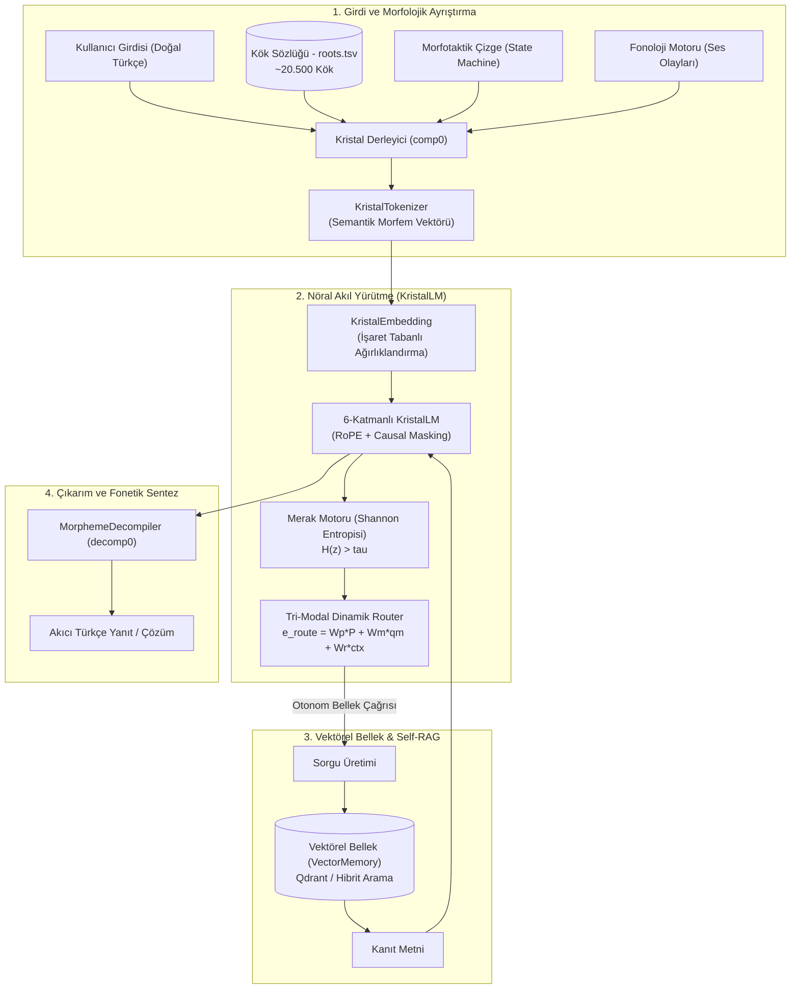

# Kristal–Vektörel Mimarisi (Crystal-Vector Engine v1.2)

[](https://python.org)
[](https://pytorch.org)
[-brightgreen.svg)]()
[]()
[]()

> **Türkçe ve sondan eklemeli (agglutinative) diller için geliştirilmiş, istatistiksel alt-kelime (BPE) tokenizasyonunu deterministik morfolojik ontolojiyle değiştiren ve parametrik ezber yerine otonom vektörel hafıza navigasyonunu (Self-RAG) merkeze alan nöro-sembolik dil modeli.**

---

## 🧭 Temel Mimari Vizyon ve Felsefe

Geleneksel Büyük Dil Modelleri (LLM), devasa veri setleriyle bir kez eğitilip o andan itibaren yeni hiçbir şey öğrenemeyen ve dünyadaki tüm olguları ağırlık matrislerinde ezberlemeye çalışan **"Hafızasız Devler" (Memoryless Giants)** olarak işlev görür. 

**Kristal–Vektörel Mimarisi**, bu paradigmayı iki temel ayaktan dönüştürür:

1. **Kristal Derleyici (Lego İlkesi - Sıfır OOV):**
   Türkçe gibi sondan eklemeli dillerde kelimeler rastgele BPE parçalarına bölünmez. Sonlu ve saf bir atomik kök sözlüğü ($M_k \approx 20.500$) ile yönlü çizge (durum makinesi) tabanlı morfotaktik kurallar birleştirilerek sonsuz yüzey formu deterministik olarak analiz edilir ve sentezlenir:
   $$C = \Sigma [f(M_k \Sigma M_e)]$$
2. **Vektörel Gezgin (Vector Rover & Self-RAG):**
   Model, tüm olgusal bilgileri statik ağırlıklarında ezberlemek zorunda değildir. Merak motoru ($\mathcal{H}(z) > \tau$) ve otonom `<ARA> ... </ARA>` sorgulama refleksi ile evrensel vektör veritabanında (Qdrant) gezinir; gelen `<BELGE>` içeriğine dayanarak kanıtlı yanıt üretir veya belgede bilgi yoksa dürüstçe bilgi olmadığını belirtir.

---

## 🏗️ Sistem Mimarisi



---

## ⚡ Temel Bileşenler ve Özellikler

### 1. Kristal Derleyici & Fonoloji Motoru (`src/compiler/`)
- **`lexicon.py`:** 20.500 kök morfemini $O(1)$ veya $O(k)$ karmaşıklıkta arayan, hece düşmesi ve ünsüz yumuşaması niteliklerini takip eden sözlük yöneticisi.
- **`morphotactics.py`:** Türkçe ek sıralanışını modelleyen sonlu durum makinesi (Finite State Machine). İsmin hâl ekleri, çoğul, iyelik, zaman/kip ekleri, fiilimsi türetimleri ve yeni eklenen `-ki` aitlik eki (`REL_ki`).
- **`phonology.py`:** Büyük ünlü uyumu, küçük ünlü uyumu, ünsüz sertleşmesi ve kaynaştırma harflerini yöneten saf fonksiyonel motor.
- **`decompiler.py`:** Modelin ürettiği semantik morfem dizilerini (`kitap PLURAL CASE_LOC` $\rightarrow$ `kitaplarda`) akıcı Türkçe yüzey biçimine dönüştüren ve SFT meta-etiketlerini koruyan fonetik sentezleyici.

### 2. Dil Modeli & Yönlendirici (`src/llm/`, `src/rag/`)
- **`KristalLM`:** 6 katmanlı, 768 boyutlu, Rotary Position Embedding (RoPE) ve Causal Prompt Masking ile donatılmış generatif model.
- **`CuriosityEngine` (`src/rag/merak.py`):** Modelin gizli durumundaki Shannon entropisini ($\mathcal{H}(z)$) ölçerek RAG çağrısı tetikleyen merak mekanizması.
- **`TriModalRouter` (`src/llm/router.py`):** Girdi istemi, merak projeksiyonu ve RAG bağlamını harmanlayarak dinamik uzman seçimi yapan yönlendirici katman.
- **`VectorMemory` (`src/rag/vector_memory.py`):** Qdrant tabanlı yoğun ve seyrek (BM25) hibrit arama sunan, sunucu bağlantısı olmadığında otomatik `:memory:` moduna geçen dayanıklı bellek.

---

## 📊 Külliyat ve Pedagojik Veri Dağılımı

Model, bir çocuğun gelişim aşamalarını taklit eden çok aşamalı bir pedagojik müfredatla eğitilmiştir:

| Alt Veri Kümesi | Kayıt Sayısı | Token Sayısı | Pedagojik Odak |
|---|---|---|---|
| **Ebeveynlik (Parenting Deep SFT)** | 40.000 | ~4.800.000 | 10 Morfolojik Görev (Kök, Hâl, Kip, Çoğul, İyelik, Olumsuzluk, Yeterlilik, Yapım, Segmentasyon, Sentez) |
| **GTS Anlamsal Sözlük (TDK)** | 25.000 | ~3.200.000 | Tanımlar, edebi alıntılar ve atasözü/deyim bağlamları |
| **İnteraktif Self-RAG** | 6.500 | ~850.000 | Otonom `<ARA>` sorgusu üretme, `<BELGE>` çıkarımı ve bilgi yok itirafı |
| **Türkçe Doğal Sohbet (Chat)** | 6.625 | ~850.000 | Selamlaşma, empati, günlük yaşam, asistanlık ve gençlik sohbeti |
| **Kavramsal Bebeklik (Infancy)** | 7.264 | ~950.000 | Kavramsal sınırlar, somut/soyut temel ontoloji |
| **Marangozluk Alan Uzmanlığı** | 2.240 (x10) | ~290.000 | Ahşap teknolojisi, aletler, birleştirmeler ("Carpenter AI") |
| **TOPLAM (train_deep_sft.bin)** | **87.629** | **11.216.512** | **Tam Konsolide Ana Temel Eğitim Külliyatı (21.39 MB)** |

---

## 📈 Model Başarım ve Doğrulama Metrikleri

```bash
./venv/bin/python scripts/evaluate_on_train_data.py
./venv/bin/python scripts/evaluate_chat.py
./venv/bin/python scripts/test_rag_interactive.py
```

| Görev / Değerlendirme Alanı | Başarı Oranı | Örnek Model Çıktısı |
|---|:---:|---|
| **İsmin Hâl Ekleri Tespiti** | **%100.00** | `dipten` $\rightarrow$ `CASE_ABL` |
| **İyelik Ekleri Tespiti** | **%100.00** | `benleri` $\rightarrow$ `POSS_3PL` |
| **Çoğul Eki Tespiti** | **%100.00** | `arkadaşından` $\rightarrow$ `PLURAL: Hayır` |
| **Morfolojik Sentez & Segmentasyon** | **%75.00** | `bölge POSS_3PL CASE_ABL_N` $\rightarrow$ `bölgelerinden` |
| **Marangozluk Alan Uzmanlığı** | **%80.00** | *"bu işlem için kalınlık makinesi kullanılmalıdır"* |
| **Doğal Türkçe Sohbet (Chat)** | **Yüksek Akıcılık** | *"selam harika bir gün geçiriyorum size nasıl yardımcı olabilirim"* |
| **Otonom RAG Sorgu Üretimi** | **Doğrulandı** | *"Gürgen ahşapta nerede kullanılır?"* $\rightarrow$ `<ARA> gürgen marangozluk kullanım </ARA>` |
| **Şaşkınlık (Perplexity - PPL)** | **2.40 (Loss: 0.66)** | 31.322 tokenlık genişletilmiş sözlükte kararlı yakınsama |
| **Birim Testler (Pytest)** | **%100 (67/67)** | Kök sözlüğü, morfotaktik, fonoloji, decompiler, RAG, router |

---

## 🚀 Hızlı Başlangıç (Quickstart)

### 1. Kurulum ve Ortam Hazırlığı
```bash
git clone https://github.com/onkanat/tr_llm.git
cd tr_llm

# Sanal ortam oluşturma ve bağımlılıkları yükleme
python3 -m venv venv
source venv/bin/activate
pip install -r requirements.txt
```

### 2. Test Paketini Çalıştırma
```bash
./venv/bin/pytest
```

### 3. Etkileşimli CLI Arayüzü ile Sohbet
```bash
./venv/bin/python chat_prompt.py
```

### 4. Modeli Eğitme (Fine-Tuning / Eğitim Döngüsü)
```bash
# Dengeli Sohbet ve Self-RAG verisiyle eğitme:
./venv/bin/python train.py --data data/train_chat_balanced.bin --steps 150 --batch-size 32

# Tam temel külliyat (87k kayıt) üzerinde eğitme:
./venv/bin/python train.py --data data/train_deep_sft.bin --steps 300 --batch-size 32
```

---

## 🛠️ CLI Komutları ve Parametreleri

| Betik / Komut | Önemli Parametreler | Açıklama |
|---|---|---|
| `train.py` | `--data <dosya.bin>`, `--steps <sayı>`, `--batch-size <sayı>`, `--device <cpu\|mps\|cuda>` | Modeli SFT ve causal prompt masking ile eğitir. |
| `chat_prompt.py` | `mode` (SFT/Normal/RAG), `temp <sayı>`, `top_k <sayı>` | Terminal üzerinden modelle gerçek zamanlı interaktif sohbet ve morfem analizi sağlar. |
| `scripts/evaluate_chat.py` | Yok | 12 farklı senaryoda diyalog çıkarımlarını test eder ve decompile eder. |
| `scripts/test_rag_interactive.py` | Yok | `<ARA>` sorgusu üretimi, belgeden çıkarım ve bilgi yok itirafını test eder. |
| `scripts/evaluate_on_train_data.py` | Yok | Perplexity, 10 morfolojik görev ve alan uzmanlığı regresyon testlerini yürütür. |
| `scripts/prepare_deep_dataset.py` | Yok | Tüm alt kümeleri birleştirerek 11.2M tokenlık `train_deep_sft.bin` dosyasını derler. |
| `scripts/prepare_chat_balanced_dataset.py` | Yok | Chat + Self-RAG odaklı dengeli `train_chat_balanced.bin` dosyasını derler. |

---

## 📖 Dökümantasyon Bağlantıları

- 📘 [Kullanıcı ve Geliştirici Kılavuzu (USER_GUIDE.md)](file:///Users/hakankilicaslan/Git/tr_llm/USER_GUIDE.md)
- 📝 [Değişiklik Günlüğü (CHANGELOG.md)](file:///Users/hakankilicaslan/Git/tr_llm/CHANGELOG.md)
- 🧠 [Proje Wiki ve Kavramsal Dökümanlar (wiki/index.md)](file:///Users/hakankilicaslan/Git/tr_llm/wiki/index.md)
- 🔬 [Test ve Çıkarım Özetleri (walkthrough.md)](file:///Users/hakankilicaslan/.gemini/antigravity/brain/367cdc8e-1eb3-4467-ad6a-4909176f4e61/walkthrough.md)

---

## 📜 Lisans ve Katkı
Bu proje Apache 2.0 lisansı altında sunulmaktadır. Katkıda bulunmak için lütfen pull request açmadan önce birim testlerinin tamamının geçtiğinden (`pytest`) emin olunuz.
