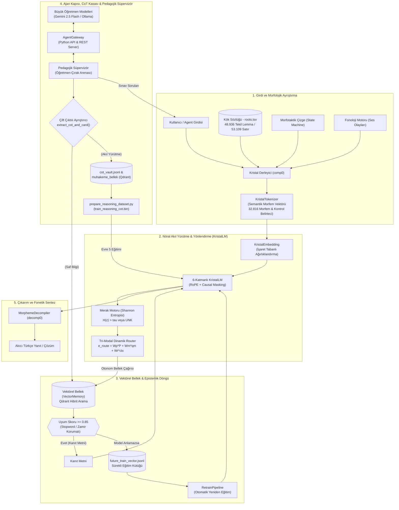

# Kristal–Vektörel Mimarisi (Crystal-Vector Engine v1.8)

[](https://python.org)
[](https://pytorch.org)
[-brightgreen.svg)]()
[-blueviolet.svg)]()
[]()
[]()
[-red.svg)](https://huggingface.co/datasets/onkanat/turk-tarihi-1931-sft-dpo)
[]()

> **Türkçe ve sondan eklemeli (agglutinative) diller için geliştirilmiş; istatistiksel alt-kelime (BPE) tokenizasyonunu deterministik morfolojik ontolojiyle değiştiren, parametrik ezber yerine otonom vektörel hafıza navigasyonunu (Self-RAG) hedefleyen, 1931 Maarif Vekaleti Türk Tarihi müfredatıyla zenginleştirilmiş (SFT ➔ Chat ➔ DPO), öğretmen modellerin akıl yürütme (CoT) adımlarını izole bir kasada saklayıp deklaratif belleği arındıran nöro-sembolik dil modeli mimarisi.**

---

## 🧭 Temel Mimari Vizyon ve Felsefe

Geleneksel Büyük Dil Modelleri (LLM), devasa veri setleriyle bir kez eğitilip o andan itibaren yeni hiçbir şey öğrenemeyen ve dünyadaki tüm olguları ağırlık matrislerinde ezberlemeye çalışan **"Hafızasız Devler" (Memoryless Giants)** olarak işlev görür. 

**Kristal–Vektörel Mimarisi**, bu paradigmayı üç temel ayaktan dönüştürür:

1. **Kristal Derleyici (Lego İlkesi - Sıfır OOV):**
   Türkçe gibi sondan eklemeli dillerde kelimeler rastgele BPE parçalarına bölünmez. Sonlu ve saf bir atomik kök ontolojisi ($M_k = 48.936$ tekil TDK GTS lemmması, $32.816$ aktif token) ile yönlü çizge (durum makinesi) tabanlı morfotaktik kurallar birleştirilerek sonsuz yüzey formu deterministik olarak analiz edilir ve sentezlenir:
   $$C = \Sigma [f(M_k \Sigma M_e)]$$
2. **Vektörel Gezgin (Vector Rover, Self-RAG & Epistemik Döngü):**
   Model, tüm olgusal bilgileri statik ağırlıklarında ezberlemek zorunda değildir. Merak motoru ($\mathcal{H}(z) > \tau$) ve otonom `<ARA> ... </ARA>` sorgulama refleksi ile evrensel vektör veritabanında (Qdrant) gezinir; $\ge 0.85$ uyumlu kanıt metni ile yanıt üretir. Eğer model yüksek uyumlu belgeyi almasına rağmen anlayamazsa, bu örnek `future_train_vector.jsonl` kütüğüne kaydedilerek otonom yeniden eğitim döngüsünü besler.
3. **İzole Akıl Yürütme Kasası (CoT Vault & Morphemic Reasoning):**
   Öğretmen modellerin (Gemini, Ollama) ürettiği derin düşünce adımları çöpe atılmaz veya deklaratif belleğe bulaştırılmaz; çift çıktılı ayrıştırıcı (`extract_cot_and_card`) ile ayrıştırılır. Temiz bilgi kartları (`<BILGI_KARTI>`) doğrudan `kristal_bellek`'e aktarılırken, düşünce zincirleri (`<DUSUNCE>`) `data/pedagogy/cot_vault.jsonl` kasasında ve `muhakeme_bellek` koleksiyonunda arşivlenerek Evre 5 morfemik akıl yürütme eğitimine zemin hazırlar.

---

## 🏗️ Sistem Mimarisi



---

## ⚡ Temel Bileşenler ve Özellikler

### 1. Kristal Derleyici & Fonoloji Motoru (`src/compiler/`)
- **`lexicon.py`:** 48.936 tekil kök morfemini (TDK GTS ontolojisi, 53.109 satır) $O(1)$ veya $O(k)$ karmaşıklıkta arayan, hece düşmesi ve ünsüz yumuşaması niteliklerini takip eden sözlük yöneticisi.
- **`morphotactics.py`:** Türkçe ek sıralanışını modelleyen sonlu durum makinesi (Finite State Machine). İsmin hâl ekleri, çoğul, iyelik, zaman/kip ekleri, fiilimsi türetimleri ve yeni eklenen `-ki` aitlik eki (`REL_ki`).
- **`phonology.py`:** Büyük ünlü uyumu, küçük ünlü uyumu, ünsüz sertleşmesi ve kaynaştırma harflerini yöneten saf fonksiyonel motor.
- **`decompiler.py`:** Modelin ürettiği semantik morfem dizilerini (`kitap PLURAL CASE_LOC` $\rightarrow$ `kitaplarda`) akıcı Türkçe yüzey biçimine dönüştüren ve SFT meta-etiketlerini koruyan fonetik sentezleyici.

### 2. Dil Modeli, Merak & Yönlendirici (`src/llm/`, `src/rag/`)
- **`KristalLM`:** 6 katmanlı, 768 gizli boyutlu ($d_{\text{model}}$), 6 dikkat başlıklı, Vanilla GELU aktivasyonlu iki katmanlı MLP ($3072$ ara boyut), Rotary Position Embedding (RoPE), Causal Prompt Masking ve bağımsız giriş/çıkış projeksiyon matrislerine sahip (**Weight-Tied: False**) **92.97M parametreli** generatif dil modeli.
- **`CuriosityEngine` (`src/rag/merak.py`):** Modelin gizli durumundaki Shannon entropisini ($\mathcal{H}(z) = -\sum p \log p$) ölçerek belirsizlik eşiğinde ($\mathcal{H}(z) > \tau$) merak vektörü ($q_{\text{merak}}$) sentezleyen mekanizma.
- **`TriModalRouter` (`src/llm/router.py`):** Girdi istemi ($P$), merak projeksiyonu ($q_{\text{merak}}$) ve RAG bağlamını ($ctx_{\text{rag}}$) harmanlayarak dinamik uzman seçimi yapan yönlendirici katman.
- **`VectorMemory` (`src/rag/vector_memory.py`):** Qdrant tabanlı yoğun (KristalEmbedding) ve seyrek (BM25) hibrit arama sunan, çift koleksiyonlu (`kristal_bellek` & `simulasyon_bellek`), sunucu bağlantısı olmadığında otomatik `:memory:` moduna geçen dayanıklı bellek.
- **`EpistemicCuriosityAgent` (`src/rag/epistemic_agent.py`):** Merak, router ve hibrit arama döngüsünü işleten; $\ge 0.85$ uyumlu kanıt metinlerine rağmen modelin anlayamadığı durumları tespit edip `data/future_train_vector.jsonl` kütüğüne kaydeden otonom ajan.

### 3. Ajan Kapısı, CoT Kasası & Pedagojik Süpervizör (`src/gateway/`)
- **`AgentGateway` (`src/gateway/agent_gateway.py`):** Büyük agent modellerinin (Antigravity Agent, Gemini API, Ollama) küçük modelle çift yönlü iletişim kurmasını sağlayan Python arayüzü, `muhakeme_bellek` akıl yürütme enjeksiyonu (`inject_reasoning_trace`) ve yerleşik HTTP REST API sunucusu (`/api/query`, `/api/inject`, `/api/status`, `/api/backlog`).
- **`PedagogicalSupervisor` (`src/gateway/pedagogical_supervisor.py`):** Modeli sınavdan geçiren, yanıtları değerlendiren, çift çıktılı ayrıştırıcı (`extract_cot_and_card`) ile düşünce zincirlerini (`<DUSUNCE>`) `data/pedagogy/cot_vault.jsonl` kasasına ve `muhakeme_bellek`'e izole eden, saf deklaratif bilgi kartlarını (`<BILGI_KARTI>`) ise `kristal_bellek`'e enjekte eden usta-çırak denetçisi.
- **`RetrainPipeline` (`src/gateway/retrain_pipeline.py`):** `future_train_vector.jsonl` dosyasında biriken çözülememiş epistemik açıkları derleyip modeli otonom yeniden eğiten Karpathy Continuous Learning Loop motoru ve sıfır-unutmalı sözlük cerrahisi (`expand_model_vocabulary`).

---

## ⚖️ Mimari Durum: Doğrulanan Gerçek (v1.8) vs. Faz B2 Yol Haritası

| Mimari Katman | Doğrulanan Gerçek (Mevcut Durum - v1.8) | Faz B2 ve Gelecek Yol Haritası |
| :--- | :--- | :--- |
| **Tokenizer** | Deterministik morfolojik etiketleyici (`kitap PLURAL CASE_LOC`). 48.936 TDK GTS kökü, 32.816 aktif token. Varlıklar `<PROPER_NOUN>`'a düşer. | **İki Katmanlı Hibrit Tokenizer:** Kapalı gramer için morfemler + açık uçlu özel isim ve sayılar için literal yüzey varlık katmanı. |
| **Model** | **92.97M Parametre** (42.53M Transformer gövdesi + 50.44M kelime tabloları, Untied, Vanilla GELU). Dar alanda (Ahşap) %92.67 MCQ ayırt etme. | **FSM-Kılavuzlu Çıkarım (Constrained Decoding):** Ek seçiminde biçimsel sentaks hatalarını sıfırlayan aktif FSM logit maskesi. |
| **Veri & Ölçek** | Sıfırdan 2.5M token ile eğitildi (**Chinchilla optimalinin %0.13'ü**). Vocab'ın %85'i (27.991 token) sıfır gradyan almıştır. | **10× Veri Genişletmesi:** 25M+ token sentetik RAG-sentez ve akıcılık külliyatı ile veri açlığını kapatma. |
| **Retrieval (RAG)** | Qdrant vektörel bellek altyapısı ve araçları hazır. Model ağırlıklarında `<ARA>` ve `<BELGE>` sentezi henüz eğitilmedi. | **Faz B2 RAG-Sentez Pilotu:** Belgeye koşullu okuma-anlama, seçici sentez ve dürüst çekinme (abstain) eğitimi. |
| **Muhakeme (CoT)** | Çift çıktılı ayrıştırıcı ve CoT kasası (`cot_vault.jsonl` & `muhakeme_bellek`) arşiv olarak çalışmaktadır. | **Yol C (Retrieval-Only):** Düşünce izleri model içine zorlanmayacak; harici RAG bağlamı olarak agent seviyesinde sunulacaktır. |
| **Sürekli Öğrenme** | `retrain_pipeline.py` ve sözlük cerrahisi altyapısı mevcuttur. | **Güvenlik Kilitleri:** Otomatik held-out eval gate, kalite filtresi ve otomatik rollback mekanizması. |

---

## 🔬 Doğrulanmış Model Parametre Dökümü (KristalLM)

```
Kelime Dağarcığı (Vocab): 32.816 token
1. Giriş Embedding Katmanı:  25.202.688 (%27.1)  --> Embedding(32816, 768)
2. 6 Transformer Bloğu:     42.527.232 (%45.7)  --> 6 x [Attention(768) + MLP(768->3072->768, GELU)]
3. Çıkış LM Head Katmanı:    25.235.504 (%27.1)  --> Linear(768, 32816, bias=True)
4. Son LayerNorm:                 1.536
-----------------------------------------------------------------------------------
TOPLAM MODEL PARAMETRESİ:   92.966.960 (~93M Parametre)
Kelime Tabloları Toplamı:   50.438.192 (%54.2 - Weight-Tied: False)
Transformer Gövdesi:        42.528.768 (42.53M)
```

---

## 📊 Külliyat ve Cevap Düzeyi Ölçümlü Veri Dağılımı (Adım B1.5)

Külliyat, veri sızıntılarını önlemek amacıyla normalize soru metni (`clean_q`) ve normalize cevap metniyle kümelenmiş, tekil (deduplicated) ve dengelenmiş **16.253** kayıttan oluşur. Mevcut tarihsel bölmede soru düzeyinde sıfır sızıntı (`Train ∩ Test = 0`, %0,0) sağlanmış olup, cevap düzeyinde ise kısa sınıflandırma etiketleri ve şablon kopyaları nedeniyle %43,4 (704/1.622; 408 kısa kapalı-sınıf etiketi, 296 şablon içerik cevabı) örtüşme ölçülmüştür:

| Alt Veri Kümesi (Katman) | Toplam Tekil Kayıt | Train (Eğitim) | Val (Doğrulama) | Test (Held-Out) | Pedagojik Odak |
|---|:---:|:---:|:---:|:---:|---|
| **Türk Tarihi 1931** | 6.507 | 5.207 | 650 | 650 | 1931 Maarif Vekaleti 4 Ciltlik Lise Tarihi |
| **Ebeveynlik (Parenting Morfoloji)** | 5.300 | 4.240 | 530 | 530 | Kök, çoğul, hâl ve kip morfolojik talimleri (Dengelenmiş tavan) |
| **Marangozluk (Carpenter)** | 3.825 | 3.061 | 382 | 382 | Ahşap teknolojisi, aletler, geleneksel geçmeler |
| **Lise Temel Bilim (Foundation)** | 298 | 240 | 29 | 29 | Lise fen, mantık ve temel bilimler |
| **Türk Edebiyatı & Şiir** | 198 | 160 | 19 | 19 | Divan edebiyatı, aruz ve nazım biçimleri |
| **Ortaokul Türkçe & Sosyal** | 125 | 101 | 12 | 12 | Ortaokul düzey kazanımlar |
| **TOPLAM (b1_5_splits)** | **16.253** | **13.009** | **1.622** | **1.622** | **Soru Sızıntısız (%0 Leakage) Kanonik Külliyat** |

> *Not:* Önceki sürümlerde yer alan bozuk Chat (6.000 kayıtta yalnızca 55 eşsiz yanıt) ve yankı üreten RAG kütükleri B1.5 eğitimine dahil edilmemiştir; Phase B2 öncesinde bağımsız olarak yeniden üretilecektir.

---

## 📈 Model Başarım ve Doğrulama Metrikleri (B1.5 Ölçüm Raporu)

| Görev / Değerlendirme Alanı | Başarı Oranı | Ölçüm ve Durum Açıklaması |
|---|:---:|---|
| **Makro (Katman-Eşit) Ortalama** | **Model %37.20 vs. Taban %39.21** | 5 katman eşit ağırlıklandırıldığında sözcüksel taban üstündür (**Taban Üstün**). Örneklem-ağırlıklı toplam (%51.97) yalnızca marangozluk ağırlığını yansıtır. |
| **Marangozluk Alan Uzmanlığı (Zor-Negatif)** | **%92.67** ($N=300$) | Sıfır sızıntılı held-out testte sözcüksel tabana (%34.67) karşı istatistiksel üstünlük (McNemar $\chi^2 = 162.66, p = 1.40 \times 10^{-46}$, **BAŞARILI**). |
| **Marangozluk Serbest Üretim Kalitesi ($N=100$)** | **Ezber %0, Tutarsızlık %8, ROUGE 0.385, Kesişim %53** | Held-out $N=100$ üretim testinde ezber (<%10) ve ROUGE (>=0.35) geçildi; ancak tutarsızlık (%8 > %5) ve kesişim (%53 < %80) eşik altı kaldı (**BAŞARISIZ**; terim ayrıştırma yüksek olsa da serbest sentaks sentezinde zaaf sürüyor). |
| **Türk Tarihi Parametrik Bellek (Zor-Negatif)** | **%15.67** ($N=300$) | Sözcüksel tabanın (%30.33) altında kaldı (McNemar $p = 5.40 \times 10^{-5}$, **BAŞARISIZ**). Modelin geniş ansiklopedik veriyi ağırlıklarında tutamadığını gösterir. |
| **Türk Tarihi PMI Tanısı ($\Delta \log P$, $N=300$)** | **Top-1: %38.33 / Ortalama Sıra: 2.48** | Boş prompt altındaki dil modeli öncülü çıkarıldığında ($\text{PMI} = \log P(A \mid Q) - \log P(A)$) Top-1 %15.67'den **%38.33**'e fırlamakta (sözcüksel tabanı geçer), ortalama sıra **2.48 / 10**'a inmekte, Top-3 **%78.33** ve Top-5 **%93.67** olmaktadır. Semantik sinyal mevcuttur ancak yüksek frekanslı LM prior altında maskelenmektedir; RAG ampirik olarak zorunludur. |
| **İsmin Hâl, İyelik ve Çoğul Tespiti** | **%100.00** | Temel morfolojik çekim ve ek tespiti görevleri tam başarıyla sürdürülmektedir. |
| **Morfolojik Sentez & Segmentasyon** | **%75.00** | `bölge POSS_3PL CASE_ABL_N` $\rightarrow$ `bölgelerinden` (E7 regresyon paketi korunuyor). |
| **Toplu Üretim Ezber Oranı (Held-Out)** | **%0.00** ($N=100$) | Eğitimdeki 163.779 4-gram'dan sıfır ezber; model şablon kopyalamamaktadır. |
| **Toplu Üretim Tutarsızlık & Sentez (Karma)** | **%39.00 / ROUGE 0.4655** | Ağırlıklı ortalama tutarsızlığın %35'i parenting kök çıktılarından kaynaklanır; ROUGE 0.4655 parenting kutupları nedeniyle yüksektir (Tarih serbest üretim ROUGE: 0.0830). |
| **Otonom RAG & Vector Rover (Adım B2)** | *Ön-Kayıt Tamamlandı* | `pre_registration_b2_rag.md` kütüğünde operasyonel yargıçlar (`QueryRuleJudge`, `BidirectionalFaithfulnessJudge`) ve iki aşamalı fallback ön-kaydedildi. |
| **Birim ve Entegrasyon Testleri** | **%100 (99/99)** | Kök sözlüğü, durum makinesi, fonoloji, decompiler, ses türemesi, RAG, merak, router, gateway, retrain, CoT izolasyonu ve morfoloji regresyon altın paketi. |

---

## 🚀 Hızlı Başlangıç (Quickstart)

### 1. Kurulum ve Ortam Hazırlığı
```bash
git clone https://github.com/onkanat/tr_llm.git
cd tr_llm

# Sanal ortam oluşturma ve bağımlılıkları yükleme
python3 -m venv venv
source venv/bin/activate
pip install -r requirements.txt
```

### 2. Test Paketini Çalıştırma
```bash
./venv/bin/pytest
```

### 3. Etkileşimli CLI Arayüzü ile Sohbet & Ajan Arenası
```bash
./venv/bin/python chat_prompt.py
# Doğrudan terminalden 'arena' yazarak pedagojik süpervizör moduna geçebilirsiniz.
```

### 4. Otonom Ajan Arenasını veya REST API Sunucusunu Çalıştırma
```bash
# 1931 Türk Tarihi müfredatında 3 turluk otonom pedagojik sınav ve RAG doğrulama:
./venv/bin/python scripts/run_agent_arena.py --domain history_1931 --rounds 3 --device cpu

# Ahşap alanında 2 turluk otonom pedagojik sınav ve RAG enjeksiyonu:
./venv/bin/python scripts/run_agent_arena.py --domain carpenter --rounds 2

# Dış agent sistemleri için REST API sunucusu:
./venv/bin/python scripts/run_agent_arena.py --server --port 8080
```

### 5. 3 Aşamalı Sıralı Model Eğitimi (SFT ➔ Chat ➔ DPO)
```bash
# 0. Veri Hazırlık ve Entegrasyon Boru Hattını Çalıştırma:
./venv/bin/python scripts/prepare_turk_tarihi_pipeline.py

# 1. Aşama (SFT): Temel Lise ve 1931 Tarih Külliyatı Eğitimi (Metal GPU / MPS):
./venv/bin/python train.py --data data/train_pedagogy_highschool.bin --steps 200 --batch-size 16 --device mps
cp data/kristal_model.pt data/kristal_model_sft.pt

# 2. Aşama (Chat): Çok Turlu Tarih ve Dengeli Sohbet İnce Ayarı:
./venv/bin/python scripts/train_chat_sft.py --data data/train_chat_balanced.bin --steps 200 --batch-size 16 --device mps

# 3. Aşama (DPO): Direct Preference Optimization (Bradley-Terry Sigmoid Kaybı):
./venv/bin/python train_dpo.py --data data/pedagogy/turk_tarihi_dpo_tokenized.jsonl --steps 100 --batch-size 4 --beta 0.1
```

> [!IMPORTANT]
> **Güncel veri hattı ve eğitim kapıları (16 Eyl 2026):**
> - Eğitim hattı (`train.py` ile çağrılan `train_scientific_sft.py`, `retrain_clean_models.py`, `run_goal_pipeline.py`, `evaluate_sft_benchmarks.py`) artık **`data/train_balanced_sft_v2.bin`** okur ve sözlük olarak **`data/rebuild/vocab_base_32852.json` (32.852)** yükler; checkpoint'ler `resize_state_dict` ile hizalanır ve uyumsuzluk `[SOZLESME_UYARI]` satırıyla **görünür** biçimde basılır.
> - **Donmuş yola yazım operatör onayı ister:** dört eğitim girişi yazmadan önce `check_frozen_save_path` çağırır; onay `--allow-frozen-write` ile verilir ve hedef `writes[]`'te beyan edilip üst dizin kiralanmalıdır.
> - **`<PAD>` kayıp maskesi** varsayılan olarak aktiftir ve kayıp **ölçeğini** değiştirir → maskeleme öncesi/sonrası kayıp değerleri kıyaslanmamalıdır.
> - Eğitim koşumları sırasında makinede GPU tüketen başka iş çalıştırılmamalıdır (ölçüldü: adım süresi 0,43 → 3,45 sn/adım).

---

## 🛠️ CLI Komutları ve Parametreleri

| Betik / Komut | Önemli Parametreler | Açıklama |
|---|---|---|
| `train.py` | `--data <dosya.bin>`, `--load-path <model.pt>`, `--save-path <model.pt>`, `--steps <sayı>`, `--batch-size <sayı>`, `--device <cpu\|mps\|cuda>`, **`--allow-frozen-write`**, **`--no-pad-mask`** | Modeli SFT, causal masking ve modüler uzmanlık ağırlıklarıyla eğitir. Donmuş `data/*.pt` hedefine yazmak için `--allow-frozen-write` **zorunludur** (aksi halde `RuntimeError`); `<PAD>` kayıp maskesi **varsayılan aktif**tir (`--no-pad-mask` ile kapanır). |
| `scripts/train_chat_sft.py` | `--data <dosya.bin>`, `--steps <sayı>`, `--batch-size <sayı>`, `--device <cpu\|mps>`, `--base-model <model.pt>` | Causal prompt masking ile sohbet ve diyalog yeteneklerini dengeli biçimde ince ayarlar. |
| `train_dpo.py` | `--data <dosya.jsonl>`, `--steps <sayı>`, `--batch-size <sayı>`, `--beta <sayı>`, `--active-model <pt>`, `--ref-model <pt>` | Dondurulmuş referans model ile aktif model arasında Bradley-Terry DPO optimizasyonu yürütür. |
| `scripts/prepare_turk_tarihi_pipeline.py` | Yok | HF 1931 Türk Tarihi veri setini indirip derler, sözlüğü genişletir ve Qdrant'a indeksler. |
| `scripts/run_agent_arena.py` | `--domain <history_1931\|carpenter\|pedagogy\|literary>`, `--rounds <sayı>`, `--auto-retrain`, `--server` | Usta-çırak pedagojik döngüsünü (Gemini/Ollama) veya HTTP REST API Gateway sunucusunu başlatır. |
| `chat_prompt.py` | `--model <model.pt>`, `mode` (SFT/Normal/RAG), `arena`, `--gateway` | Terminal üzerinden çekirdek veya uzmanlaşmış modelle gerçek zamanlı interaktif diyalog sağlar. |
| `rag_tool.py` | `add`, `search`, `list`, `status`, `reset` | Vektörel belleğe (kristal_bellek) harici TXT, MD, PDF veya JSON belge ekler ve yönetir. |
| `scripts/prepare_reasoning_dataset.py` | `--vault <yol>`, `--output <yol>`, `--min-len <sayı>` | CoT kasasındaki düşünce zincirlerini Evre 5 için `train_reasoning_cot.bin` olarak derler. |
| `scripts/sanitize_vector_memory.py` | `--db-path <yol>`, `--clean-points`, `--seed-woods` | Qdrant vektörel belleğini CoT sızıntılarından arındırır ve saf ağaç/marangozluk kartlarını indeksler. |
| `scripts/prepare_pedagogy_high_school_dataset.py` | Yok | Bebeklik, morfoloji, edebiyat ve 1931 Tarih SFT verisini `train_pedagogy_highschool.bin` olarak derler. |
| `scripts/prepare_chat_balanced_dataset.py` | Yok | Chat + Self-RAG + 1931 Tarih diyalogları odaklı `train_chat_balanced.bin` dosyasını derler. |
| `scripts/prepare_carpenter_specialization_dataset.py` | Yok | Evre 4 Ahşap & Marangozluk dikey uzmanlık kümesini `train_carpenter_specialization.bin` olarak derler. |
| `scripts/prepare_b1_5_datasets.py` | Yok | Soru ve cevap normalize kümeleme ile soru düzeyinde %0 sızıntılı (cevap düzeyi ölçümlü) Train/Val/Test bölmesi ve disk-tabanlı aday kümelerini üretir. |
| `scripts/evaluate_lexical_baseline.py` | Yok | Yalnızca `train.jsonl` üzerinden TF-IDF sözcüksel tabanını eğitir ve sabit disk adaylarını puanlar (Null Hipotezi). |
| `scripts/train_step_b1_5_rigorous.py` | Yok | Hızlı tensör önbellekleme (`train_fast_ds.pt`) ve `sign_mask` ile MPS üzerinde 3 epoch titiz eğitim yürütür. |
| `scripts/evaluate_b1_5_rigorous.py` | Yok | Diskteki kilitli zor-negatif/rastgele adaylar üzerinde eşleştirilmiş McNemar testini ve Katman 4 toplu üretim kalite metriklerini hesaplar. |
| `scripts/diagnostics_history_gap.py` | Yok | Türk Tarihi $N=300$ zor-negatif sorularında koşullu $\log P$, boş prompt dil modeli öncülü ve PMI ($\Delta \log P$) ayrıştırma tanısını yürütür. |
| `scripts/evaluate_carpenter_generation_100.py` | Yok | Marangozluk $N=100$ held-out test verisinde ezber, tutarsızlık, ROUGE-L ve soru içerik kesişimi metriklerini bağımsız ölçer. |
| `scripts/evaluate_chat.py` | Yok | 12 farklı senaryoda diyalog çıkarımlarını test eder ve decompile eder. |
| `scripts/test_rag_interactive.py` | Yok | `<ARA>` sorgusu üretimi, belgeden çıkarım ve bilgi yok itirafını test eder. |

---

## 📖 Dökümantasyon Bağlantıları

- 📘 [Kullanıcı ve Geliştirici Kılavuzu (USER_GUIDE.md)](file:///Users/hakankilicaslan/Git/tr_llm/USER_GUIDE.md)
- 📝 [Değişiklik Günlüğü (CHANGELOG.md)](file:///Users/hakankilicaslan/Git/tr_llm/CHANGELOG.md)
- 🧠 [Proje Wiki ve Kavramsal Dökümanlar (wiki/index.md)](file:///Users/hakankilicaslan/Git/tr_llm/wiki/index.md)
- 🔬 [Test ve Çıkarım Özetleri (walkthrough.md)](file:///Users/hakankilicaslan/.gemini/antigravity/brain/a6ba6c9c-dd9c-480a-a4ad-583f375c98cd/walkthrough.md)

---

## 📜 Lisans ve Katkı
Bu proje Apache 2.0 lisansı altında sunulmaktadır. Katkıda bulunmak için lütfen pull request açmadan önce birim testlerinin tamamının geçtiğinden (`pytest`) emin olunuz.
